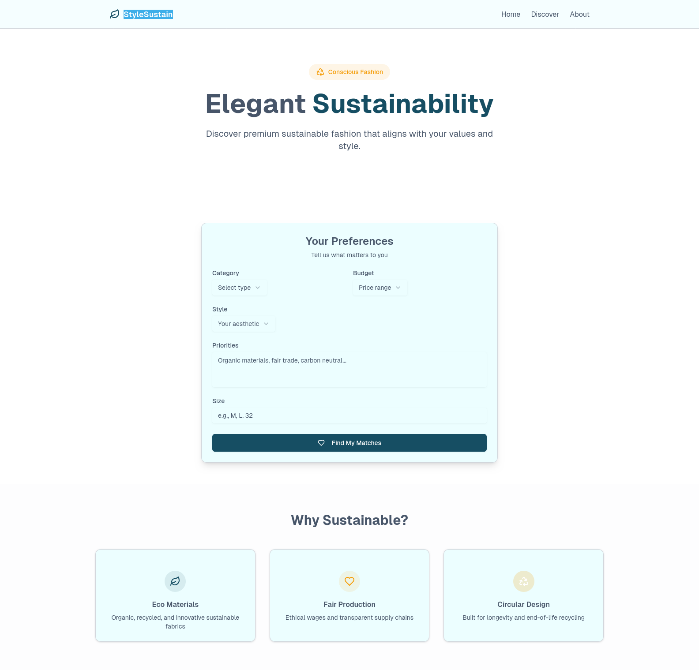
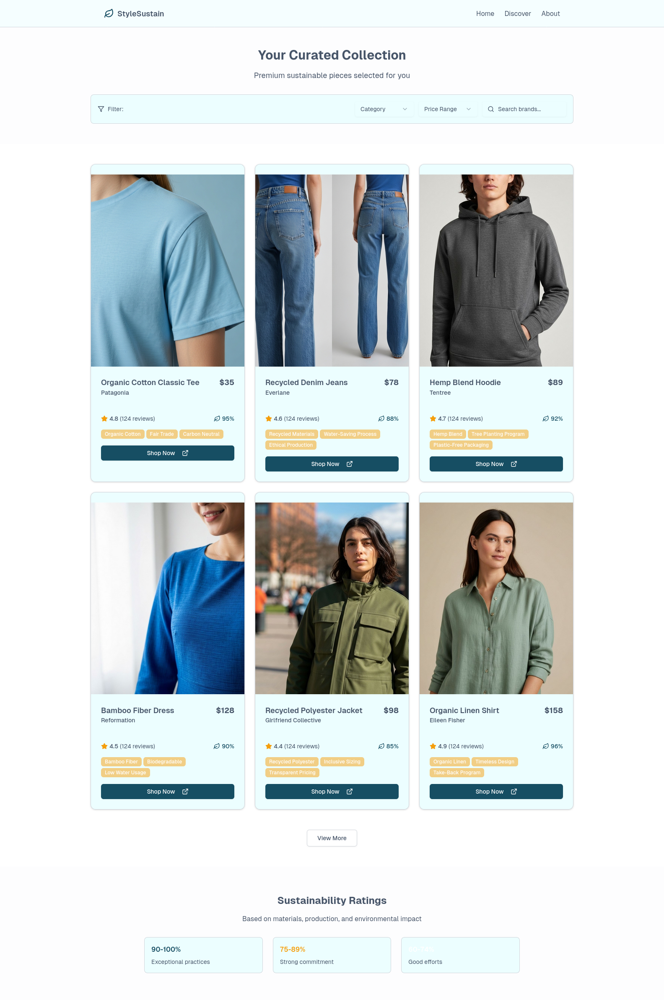
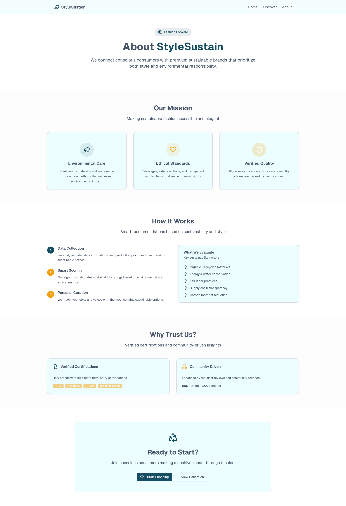

# Sustainable Shopping Planner

Welcome to the **Sustainable Shopping Planner**!  
Make smarter, greener choices for your shopping trips and reduce your environmental impact.

---

## 🌱 What is Sustainable Shopping Planner?

Sustainable Shopping Planner is an open-source project designed to help users plan shopping trips with sustainability in mind. The app suggests eco-friendly products, tracks carbon footprints, and encourages conscious consumption.

---

## 🚀 Features

- **Eco-Friendly Product Suggestions:** Get recommendations for sustainable alternatives.
- **Carbon Footprint Tracking:** Monitor environmental impact of your purchases.
- **Shopping List Organization:** Easily plan and categorize items for each trip.
- **Local & Seasonal Picks:** Discover products that are good for your region and the planet.
- **User Insights:** View stats on your shopping habits and sustainability score.

---

## 📸 Screenshots

<!-- Add screenshots/gif demos here -->




---

## 🛠️ Technologies Used

- **Frontend:** Next
- **Backend:** Node.js, Express
- **Database:** MongoDB
- **Agent:** Python
- **APIs:** Carbon tracking, product data integrations

---

## 🎯 Getting Started

### Prerequisites

- Node.js & npm installed
- MongoDB running locally or remotely

### Installation

```bash
git clone https://github.com/shoppingPlanners/sustainable-shopping-planner.git
cd sustainable-shopping-planner
npm install
```

### Running Locally

```bash
npm start
```

The app should now be available at [http://localhost:3000](http://localhost:3000).

---

## 🤝 Contributing

Contributions are welcome!  
1. Fork the repo  
2. Create your feature branch (`git checkout -b feature/AmazingFeature`)  
3. Commit your changes (`git commit -m 'Add some AmazingFeature'`)  
4. Push to the branch (`git push origin feature/AmazingFeature`)  
5. Open a Pull Request

Check out [CONTRIBUTING.md](CONTRIBUTING.md) for more details.

---

## 📄 License

Distributed under the MIT License. See [`LICENSE`](LICENSE) for more information.

---

## 💬 Contact

Questions, ideas, or feedback?  
Open an issue or reach out via [Discussions](https://github.com/shoppingPlanners/sustainable-shopping-planner/discussions).

---

## 🌟 Support & Star

If you find this project useful, please give it a ⭐️!  
Your support helps us continue building awesome sustainable tools.
